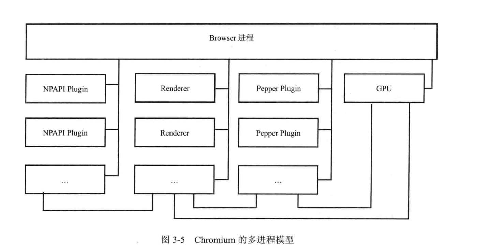
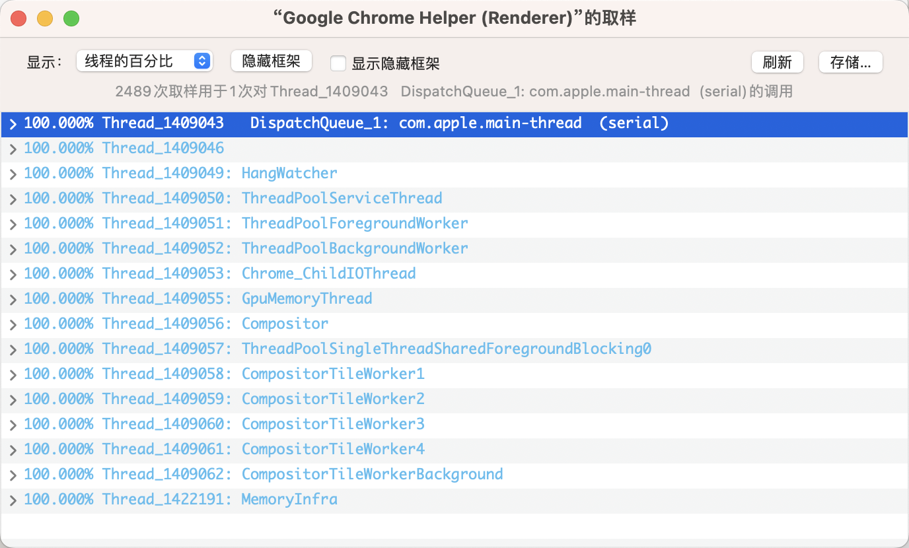

# 阅读《webkit技术内幕》的笔记
> 一些标注都记在图书里，这里是一些额外的想法

## 第二章 html网页与结构
这里谈到 DOMContentLoaded是在dom树构建完成之后调用的，onload是在各个资源（如图片等）加载完调用的，那么对于异步的js资源( async defer)是在何时调用的
```
// 用http-server 起下demo
module
1.js:1 defer
test.html:40 DOMContentLoaded
2.js:1 async
test.html:43 onload

<!-- 把html里引用的图片注释掉 -->
async
3.js:1 module
1.js:1 defer
test.html:40 DOMContentLoaded
test.html:43 onload
```
1. 可以看到defer总是在DOMContentLoaded之前调用，async前后不一致，但都是在onload之前执行，我的理解是async异步下载，下载完立刻执行，但可能下载完时dom树已经完成了构建，也可能没有，所以出现了上述情况
2. 另外，这里也说明了，async的执行顺序可能可在html里写的顺序不一致，先下载完先执行，defer执行顺序总和写的顺序一致
3. type=module的也是异步加载，类似defer的效果

## 第三章 基于Blink的Chromium浏览器架构
1. 
2. 线程间通信、进程通信的具体方式？
[Linux下的进程间通信-详解](http://t.csdn.cn/urC3O)
[进程的通信方式及特点](http://t.csdn.cn/IuLvg)
[进程间通信和线程间通信的几种方式](https://www.cnblogs.com/fanguangdexiaoyuer/p/10834737.html)
3. 
4. renderer进程中都有哪些线程呢？书中是只有两个，主线程和一个渲染解释html文档的线程，但现在应该不一样了
[Renderer进程](https://giancarlo-ma.github.io/2021/06/03/renderer%E8%BF%9B%E7%A8%8B/) 、[chrome 里渲染进程的线程有哪些？做什么的？](https://juejin.cn/post/6994750650118570014)
从上面的截图及文章可以看出，renderer里有很多线程，讨论的比较多的是主线程(html\css\js主要在这里执行,也有叫GUI线程的)、js引擎线程、定时触发器线程、事件触发线程（如点击、ajax请求等，会把相应可以执行的代码加入到消息队列中共js引擎处理）、compositor、raster、worker（包括webworker service workker）等。

关于compositor raster不了解的可以参考下面这段：
>raster和composite脱离主线程
创建层树，确定绘制顺序后，主线程将信息交给compositor线程。compositor线程光栅化每一层。一个层可以像页面那么大，所以compositor将其分成几个tiles，每一>个tile因此发送给raster线程，raster线程光栅化每一个tile，存储在GPU内存。

>compositor线程可以优先处理不同的raster线程，所以视口附近的东西可以优先光栅化。一个layer也有许多不同分辨率的tillings用于处理zoom-in这样的行为。
>一旦tiles光栅化完毕，compositor线程就会收集draw quads来创建一个compositor frame。
>draw quads包含一些信息，例如tile在内存中的位置，以及在考虑到页面合成的情况下要绘制tile的页面位置

>compositor frame是一个表示页面frame的draw quads集合。

>然后通过 IPC 将compositor frame提交到浏览器进程。此时，可以从 UI 线程为浏览器 UI变化添加另一个compositor frame，或者从其他renderer进程为
> extension添加另一个compositor frame。这些compositor frame被发送到 GPU 在屏幕上显示。如果出现滚动事件，compositor线程将创建另一个compositor frame并发送到 GPU。

> compositing的好处是它不需要涉及主线程。compositor线程不需要等待样式计算或 JavaScript 执行。这就是为什么compositing动画被认为是最好的平稳性能。如果布局或者绘制需要再次计算，那么主线程必须参与。


这里可以再重读下[深入了解现代浏览器系列](https://github.com/ascoders/weekly/blob/master/%E5%89%8D%E6%B2%BF%E6%8A%80%E6%9C%AF/221.%E7%B2%BE%E8%AF%BB%E3%80%8A%E6%B7%B1%E5%85%A5%E4%BA%86%E8%A7%A3%E7%8E%B0%E4%BB%A3%E6%B5%8F%E8%A7%88%E5%99%A8%E4%B8%89%E3%80%8B.md)，可以发现更多信息