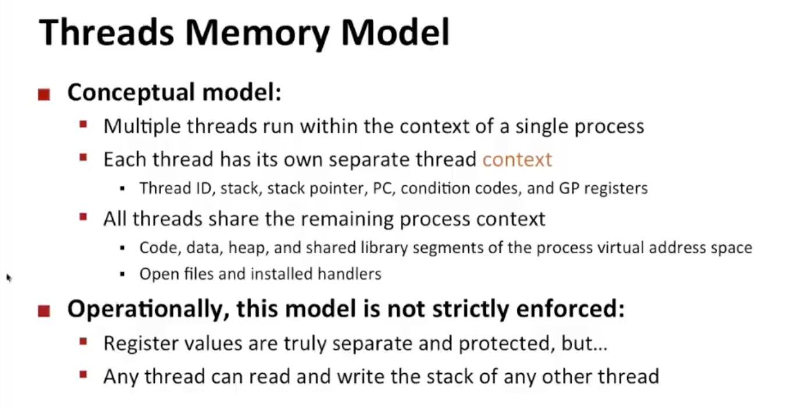
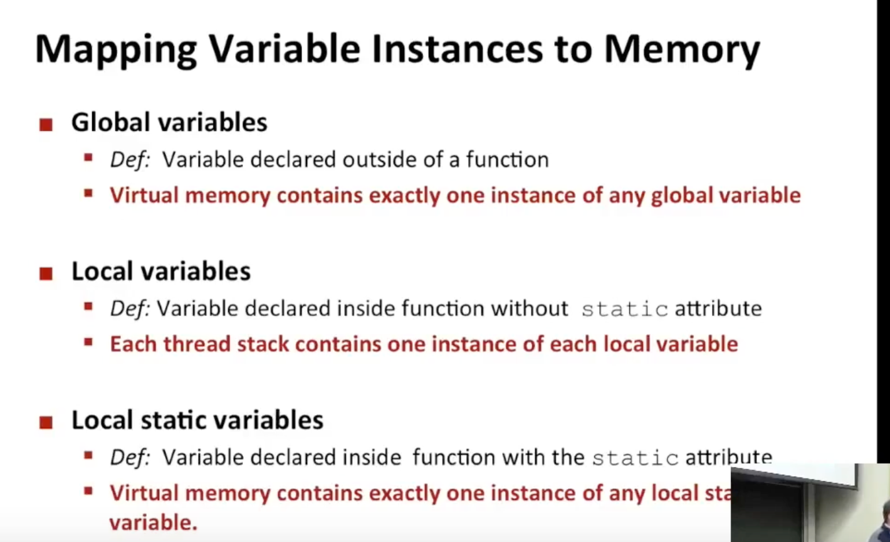
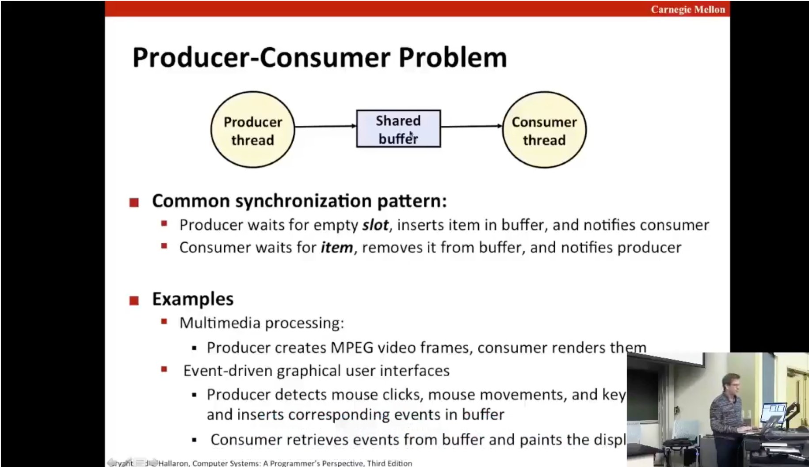
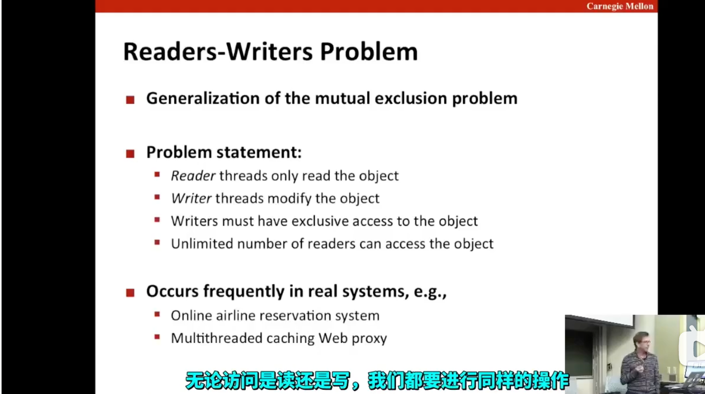
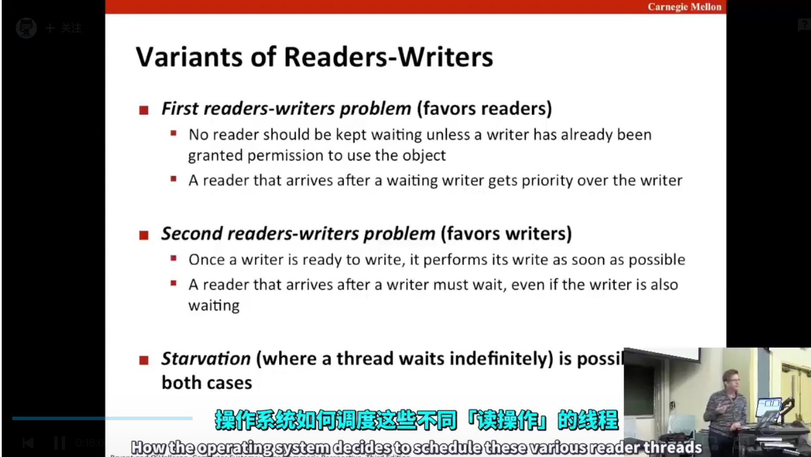
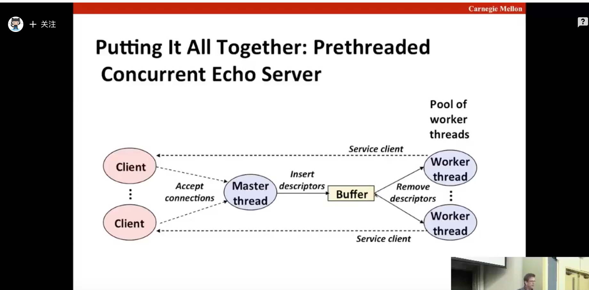
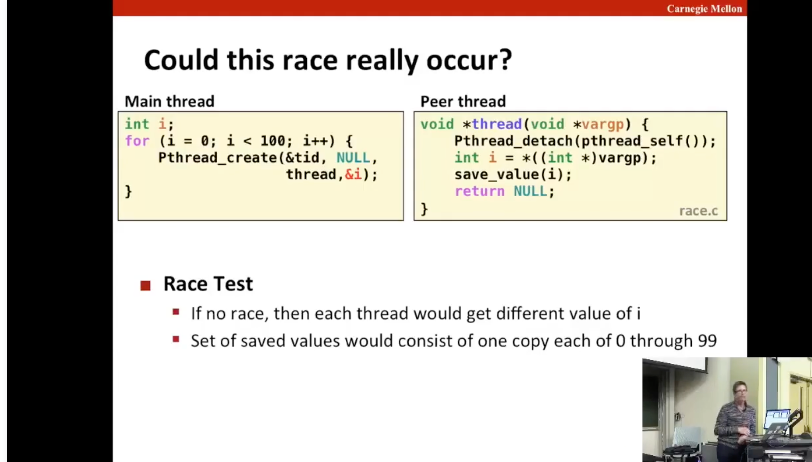
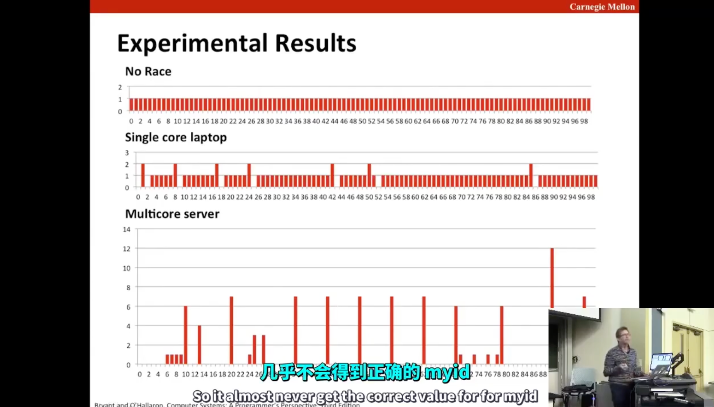
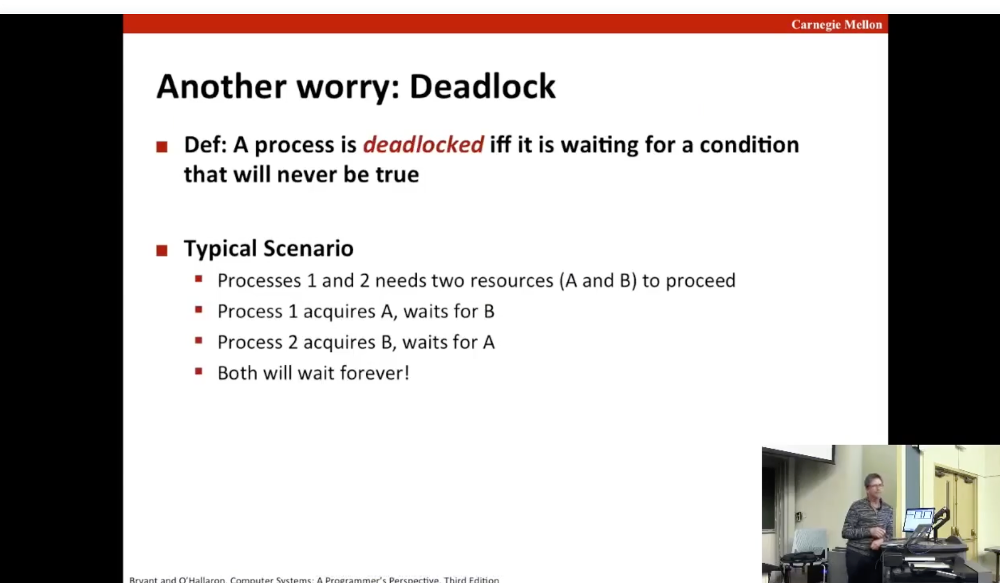

# 并发编程
##  并发编程三种方式
1. 进程并发
   优点：开销大（进程切换）
   进程相对独立，资源分配隔离
   进程间通信比较复杂
2. 事件驱动
   优点：开销小
   难以利用多核
   共享内存
   单个请求会影响全局
   nodejs nginx 都采用
3. 线程并发
   共享全局变量


### 一个变量如何判定为是共享变量
变量如果被定义在某个线程中，但仍能被其他线程引用（线程在一个进程里存储，并没有实际上的隔离），那么该变量就是共享变量。
三个问题
1. 线程基础内存模型是什么(这里想表达的就是线程内的变量也会被其他线程引用)
2. 变量实例如何映射到内存（全局变量、局部变量（函数内），局部static变量，这里都是以C语言为例）
3. 有多少线程引用该实例（单个引用的全局变量不是共享变量）



##  并发问题的解决
###  信号量
PV操作 (其实要系统介入，进行切换线程的 )
s (大于等于0的全局变量)
```
init s = 1;   // 初始化信号量

<!-- 某个线程里 -->
...
P()
操作共享变量
V()
```
解释  一个初始变量为1的信号量，每次执行P操作后-1，V操作+1
举例：
线程1 执行P操作，信号量-1 = 0
线程2 执行P操作，发现信号量=0，阻塞， 等待某个V操作
系统调用到线程1，执行V操作，信号量+1 = 1
线程2 执行P操作，发现信号量=1，继续执行
解决问题


## 经典场景
### 生产者消费者
一个队列，多个生产者，多个消费者对队列进行入队、出队操作
使用了三个信号量  1个用于控制对对列的修改，1个用于控制是否能入队，1个用于控制是否能出队 
实际场景：
1. 多媒体应用，生产mpeg 帧，消费者绘制帧到屏幕上
2. 图形用户界面，用户点击鼠标、键盘，图形系统处理鼠标移动、点击事件

### 读写问题 
实际场景
1. 订票系统，多个用户查看余票信息 可以不用互斥加锁，但如果有人要订票，更新数据库，那么就必须有互斥逻辑 
2. 多线程缓存，读缓存没问题，有一个要最新的内容时就需要处理了



## 预线程高并发的web服务器

before: 接到请求，创建一个线程/进程，处理完把线程/进程销毁， 浪费资源
after: 预先创建好多个线程/进程，接到请求后，直接分配给某个空闲的线程/进程处理 （使用前面的生产者消费者方法，请求是生产者，把请求描述符放到一个缓冲区队列，线程是消费者，获取队列里的请求描述符进行后续处理 ）

## 竞争


## 死锁
