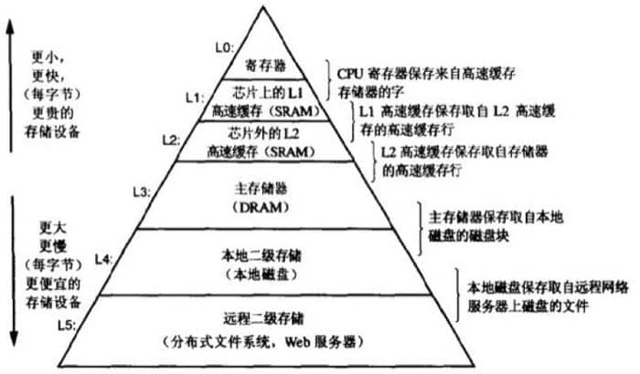

# 存储器层次结构
参考[【读薄 CSAPP】叁 内存与缓存](https://wdxtub.com/csapp/thin-csapp-3/2016/04/16/)

## 存储体系

目前的存储体系是由存储介质的价格和访问速度决定的

1. 关于存储介质（如光盘、硬盘）中的数据是怎么设计、读、写的细节参考原文

## 局部性原理
符合局部性原理的代码性能会更好（从目前数据读取的角度出发）
1. 包括时间局部性（多次访问同一个数据）、空间局部性（访问空间存储相邻的数据）
2. 空间局部性方面：步长为1的效率最高

## 缓存的实现
缓存的结构设计、读取、写入参考原文