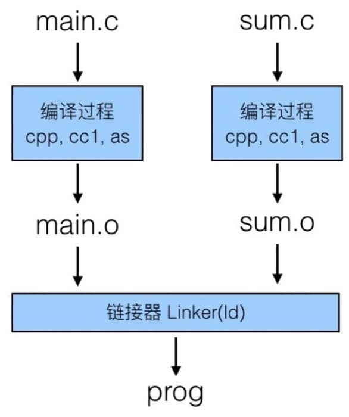
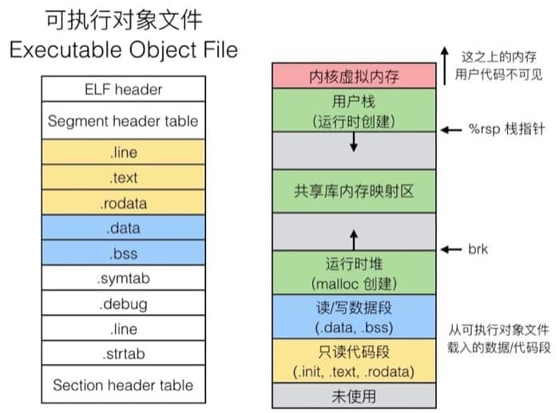
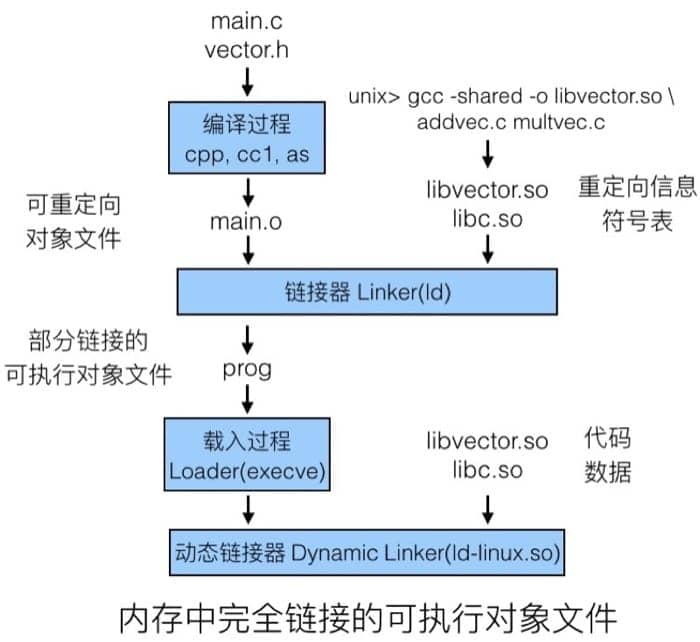

# 链接

## 源文件到可运行程序的过程

此处直接参考[编译](https://wdxtub.com/csapp/thin-csapp-4/2016/04/16/),既讲述了完整的流程，也有中间产物的介绍，有利于理解

> 预处理器：将 C 语言代码(da.c)转化成 da.i 文件(gcc –E)，对应于预处理命令 cpp

> 编译器：C 语言代码(da.c, wang.c)经过编译器的处理(gcc -0g -S)成为汇编代码(da.s, wang.s)

> 汇编器：汇编代码(da.s, wang.s)经过汇编器的处理(gcc 或 as)成为对象程序(da.o, wang.o)

> 链接器：对象程序(da.o, wang.o)以及所需静态库(lib.a)经过链接器的处理(gcc 或 ld)最终成为计算机可执行的程序

> 加载器：将可执行程序加载到内存并进行执行，loader 和 ld-linux.so
## 链接器进行链接的过程
>对应上述连接器的过程
1. 处理上述可重定位文件到可执行文件的过程
2. 执行过程分为两步
    1. 符号解析：将符号引用与符号定义关联起来
    2. 重定位：将不同可重定位文件合并为一个可执行目标文件，将其中的符号解析为内存中的地址

## 可执行目标文件加载到内存中运行
> 对应上述加载器过程
1. 可重定位文件和可执行目标文件的结构基本都是一样的(ELF格式)，只是在细节上某些字段不一样
2. 应该就是给这个程序单独分配了一个进程（图中展示了一个进程的结构）

## 静态库、动态库

1. 静态库是在链接器链接时把静态库中对应的的代码拷贝到可执行文件中
2. 动态库在链接器链接时，只是把可重定位文件中未被解析的符号记录下来，然后在后续的某个时机进行解析、加载
  
3. 动态库加载时机有两种：
> 1. 在加载器加载时，动态库中对应的代码被加载到内存中，然后动态链接器将可重定位文件中的符号解析为动态库中的地址
> 2. 在程序运行时，动态库中对应的代码被加载到内存中，然后链接器将可重定位文件中的符号解析为动态库中的地址

4. 动态库在windows上一般是dll文件（windows大量使用了该技术），在linux上一般是so文件
5. 在运行时执行动态库的也就是通过代码的方式调用
> 书中给的例子是java通过dlopen函数来调用本地c/c++编译的共享库
> 我想到的与此类似的是
> 1. 前端的动态加载 import('../home/home.vue'),和
> 2. npm install时有时会报错 python等一些依赖没有，我猜这种情况类似于js的动态加载其他电脑上的共享库了
> 3. node调用c++，实际也就是调用c++编辑的动态库

## 库打桩
1. 类似于vue中对于数组响应式的实现，保留数组的原方法，执行一些自己的逻辑，然后再调用原方法，细节我没有详细阅读